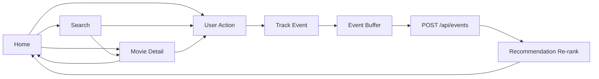
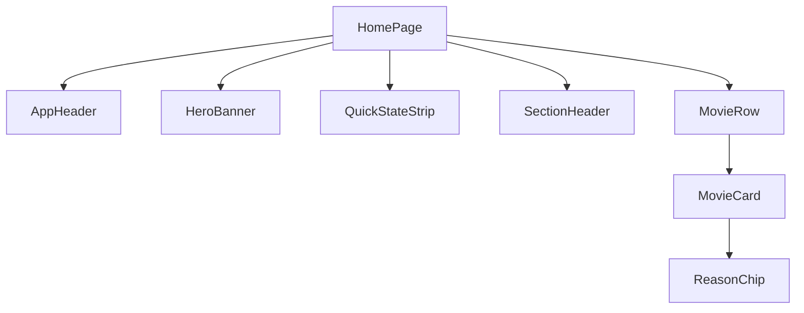
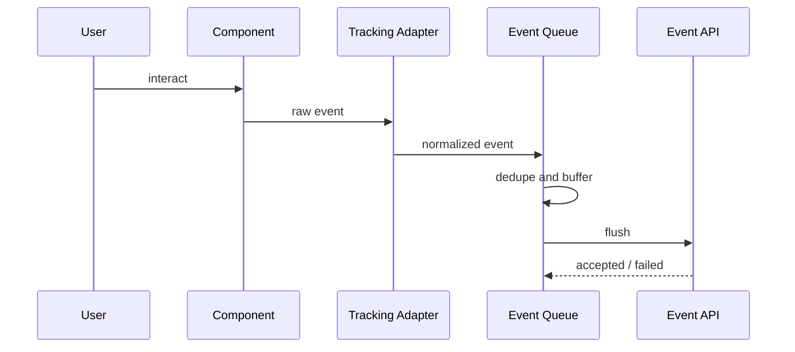
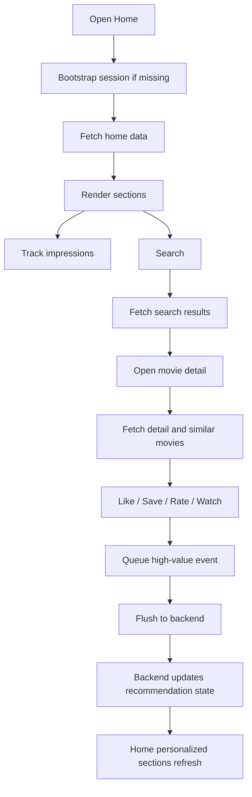

# Frontend Implementation Specification

## 1. Scope

This document defines the implementation details for the movie recommendation frontend.

This frontend includes:

- home screen
- search screen
- movie detail screen
- session bootstrap and reuse
- recommendation rendering
- event tracking and buffering
- loading, empty, fallback, and error states

This document is implementation-only. It is written to support immediate development.

---

## 2. Routes

Implement these routes:

- `/` and `/home`
- `/search`
- `/movie/[id]`

### 2.1 Route Contract

| Route | Screen Key | Required Query Params | Purpose |
| --- | --- | --- | --- |
| `/home` | `home` | none | personalized and discovery landing page |
| `/search` | `search` | `q` optional | search results and discovery fallback |
| `/movie/[id]` | `movie_detail` | `region` optional | movie detail and related recommendations |

---

## 3. Session Handling

### 3.1 Session Source

The frontend must treat `sessionId` as the stable anonymous user identity for:

- search requests
- movie detail requests
- recommendation requests
- event requests

### 3.2 Session Bootstrap Rules

Frontend behavior:

1. if no local `sessionId` exists, allow the first request to proceed without it
2. read `X-Session-Id` from the backend response
3. persist the returned `sessionId`
4. reuse the same `sessionId` on all later requests

### 3.3 Session Storage

Persist `sessionId` in browser storage with this priority:

1. cookie if the app already uses cookies safely
2. localStorage if cookie handling is not used

Expose session access through a single module:

- `lib/session/session-store.ts`

Required functions:

- `getSessionId(): string | null`
- `setSessionId(sessionId: string): void`
- `clearSessionId(): void`

### 3.4 Request Rule

For all later requests, send `sessionId` through one consistent mechanism only.

Use this order:

1. `X-Session-Id` request header
2. query parameter only if the endpoint already relies on it

Do not send conflicting values in both places.

---

## 4. Page Flow



---

## 5. Home Screen

### 5.1 Required Sections

Render the home page in this order:

1. `AppHeader`
2. `HeroBanner`
3. `QuickStateStrip`
4. `RecommendedForYouSection`
5. `TrendingSection`
6. `TopTodayWeekSection`
7. `BecauseYouLikedSection`
8. `GenreSections`
9. `ContinueExploringSection`
10. `Footer`

### 5.2 Home Data Requirements

The page must request data for:

- personalized recommendations
- trending titles
- top daily titles
- top weekly titles
- genre-based recommendations
- recently-viewed-based recommendations if available

If the backend currently exposes only `GET /api/recommendations`, the frontend must support mapping the response into multiple sections using the returned context, mode, or dedicated query params added later.

### 5.3 Home Components

#### `AppHeader`

Must include:

- brand/logo
- `Home` nav item
- search input or search trigger

Behavior:

- sticky on scroll
- compact header after downward scroll

#### `HeroBanner`

Fields to display:

- backdrop image
- title
- short overview
- genre chips
- primary CTA: `View Details`
- secondary CTA: `Watch`

Behavior:

- clicking primary CTA routes to `/movie/[id]`
- clicking secondary CTA triggers watch-start event and then routes to detail or watch target

#### `QuickStateStrip`

Display one of the following labels based on backend mode:

- `Recommended for you based on recent activity`
- `Showing fallback results`
- `Starting with trending titles for this session`

#### `RecommendedForYouSection`

Render as a horizontal row.

Each card must show:

- poster
- title
- year if available
- genres
- rating
- one reason chip if present

#### `TrendingSection`

Render as a horizontal row.

Label must be `Trending Now`.

#### `TopTodayWeekSection`

Render as one section with a two-state toggle:

- `Today`
- `This Week`

Each toggle state renders the same row component with a different data source.

#### `BecauseYouLikedSection`

Render cards tied to user preference explanations.

Section title examples are implementation labels, not backend data:

- `Because You Liked Inception`
- `Similar to Movies You Recently Viewed`

#### `GenreSections`

Render 2 to 3 rows maximum.

Each row represents one genre or theme cluster.

#### `ContinueExploringSection`

Render as one row using recently viewed, recent search intent, or fallback discovery titles.

### 5.4 Home Interaction Rules

- clicking a movie card routes to `/movie/[id]`
- horizontal rows must support:
  - trackpad horizontal scroll
  - mouse wheel with horizontal translation if container is focused
  - left/right arrow buttons
- back navigation to home must restore scroll position
- after recommendation refresh, update only affected sections and do not reset page scroll

### 5.5 Home Fallback Rules

- if personalized data is unavailable, render trending content in that slot
- if a row has fewer than 4 valid items, hide the row
- if a response returns `fallbackUsed: true`, show the fallback state strip and keep the page layout unchanged

---

## 6. Search Screen

### 6.1 Layout Order

1. `AppHeader`
2. `SearchToolbar`
3. `SearchSummaryBar`
4. `SearchHintPanel` optional
5. `SearchResultsGrid`
6. `FallbackDiscoveryBlocks` optional

### 6.2 Search Request Contract

Use `GET /api/movies/search` with:

- `q`
- `limit`
- `sessionId` or `X-Session-Id`
- `region` if supported

### 6.3 Search Toolbar

Must include:

- search input
- submit button or Enter submit support
- clear query action

### 6.4 Search Summary Bar

Must show:

- active query string
- number of results
- current serving mode
- fallback badge when `fallbackUsed: true`

### 6.5 Search Results Grid

Use a grid layout on desktop.

Each card must display:

- poster
- title
- year
- genres
- rating
- one reason chip if available
- optional one-line overview on desktop

### 6.6 Search Behaviors

- search fires on explicit submit only
- update URL query param on submit
- browser back/forward must restore:
  - query
  - results
  - scroll position when practical
- a new query may reset results scroll to top

### 6.7 Search States

#### Semantic State

- show standard results grid
- mode badge displays `semantic`

#### Fallback Text State

- show standard results grid
- mode badge displays `fallback_text`
- show fallback state label above the grid

#### Empty Query State

- do not show an empty screen
- render discovery content instead:
  - trending titles
  - popular genres
  - curated starter picks

#### Weak Result State

- if the backend returns a hint, render it in `SearchHintPanel`

---

## 7. Movie Detail Screen

### 7.1 Layout Order

1. `AppHeader`
2. `MovieDetailHero`
3. `MovieActionBar`
4. `MovieOverviewSection`
5. `RecommendationExplanationPanel`
6. `SimilarMoviesSection`
7. `YouMayAlsoLikeSection`
8. `CreditsSection` optional

### 7.2 Movie Detail Request Contract

Use `GET /api/movies/{movieId}` with:

- `sessionId` or `X-Session-Id`
- `region`

### 7.3 `MovieDetailHero`

Must display:

- poster
- title
- release year
- genres
- rating
- language
- availability status
- overview snippet

### 7.4 `MovieActionBar`

Must include:

- `WatchButton`
- `LikeButton`
- `SaveButton`
- `RatingControl`

### 7.5 Action Rules

#### Watch

- fire watch-start tracking event immediately
- update UI to reflect watch intent if needed

#### Like

- optimistic update allowed
- rollback if backend rejects

#### Save

- optimistic update allowed
- rollback if backend rejects

#### Rating

- send only committed rating value
- do not send hover/preview states

### 7.6 Explanation Panel

Render recommendation reasons as user-readable labels.

This panel must show:

- why the current movie may match the user
- why similar movies are being shown

### 7.7 Similar And Personalized Sections

Render these as separate sections:

1. `Similar to This Movie`
2. `You May Also Like`

Both sections use the shared recommendation card shape.

---

## 8. Shared Components

Implement these shared components:

| Component | Responsibility |
| --- | --- |
| `AppHeader` | top navigation and search entry |
| `HeroBanner` | large featured movie surface on home |
| `QuickStateStrip` | visible backend-mode and state message |
| `SectionHeader` | section title, subtitle, optional action |
| `MovieRow` | horizontal list container |
| `MovieGrid` | search/grid list container |
| `MovieCard` | shared movie preview card |
| `ReasonChip` | display a recommendation reason |
| `ModeBadge` | display semantic/personalized/cold-start/fallback mode |
| `SearchToolbar` | search input and actions |
| `RatingControl` | star selection and submit |
| `EmptyStatePanel` | non-blocking empty state |
| `ErrorStatePanel` | retryable section error state |
| `SkeletonRow` | row loading state |
| `SkeletonGrid` | grid loading state |

### 8.1 Component Composition Diagram



### 8.2 `MovieCard` Contract

`MovieCard` props must support:

- `movieId`
- `title`
- `posterUrl`
- `genres`
- `ratingAvg`
- `reasonLabel` optional
- `onClick`
- tracking metadata:
  - `screen`
  - `component`
  - `itemType`
  - `position`
  - `rowTitle` optional

Do not create separate incompatible card variants for home, search, and detail rows.

---

## 9. Frontend State Model

### 9.1 State Domains

Implement these state domains:

1. session state
2. route state
3. server state
4. interaction state
5. tracking buffer state

### 9.2 State Contents

#### Session State

- `sessionId`
- `sessionReady`

#### Route State

- `searchQuery`
- `movieId`
- `region`

#### Server State

- `homeSections`
- `searchResults`
- `searchMode`
- `movieDetail`
- `similarMovies`
- `recommendationMode`

#### Interaction State

- `likedMovieIds`
- `savedMovieIds`
- `ratingByMovieId`
- `watchStateByMovieId`

#### Tracking Buffer State

- queued events
- active flush timer
- retry queue
- dedupe registry for impressions and recent submits

---

## 10. Data Fetching Rules

### 10.1 Required API Clients

Implement these API client functions:

- `fetchSearchResults(input)`
- `fetchMovieDetail(input)`
- `fetchRecommendations(input)`
- `postEvent(input)`

### 10.2 Fetch Timing

- home fetches recommendation sections on page entry
- search fetches on explicit submit and on initial query-param load
- detail fetches on route entry

### 10.3 Refresh Rules

- after `like`, `save`, or `rate`, trigger home recommendation refresh when the user returns home or when a background revalidation is scheduled
- detail page may refresh personalized related content after a successful high-value event
- search page does not auto-refresh on every event

---

## 11. Event Tracking Model

### 11.1 Raw Frontend Event Shape

React components must emit this shape:

```json
{
  "timestamp": 1716201123000,
  "action": "click",
  "screen": "home",
  "component": "recommended_row",
  "itemType": "movie_card",
  "payload": {
    "movieId": "movie_inception",
    "query": null,
    "resultCount": null,
    "progressPercent": null,
    "durationSeconds": null,
    "genre": "Sci-Fi",
    "position": 3,
    "rowTitle": "Recommended for You"
  }
}
```

### 11.2 Backend Event Shape

The frontend tracking adapter must convert raw events into this request shape:

```json
{
  "sessionId": "sess_demo_001",
  "eventId": "evt_click_home_recommended_row_movie_inception_1716201123000",
  "eventType": "click",
  "movieId": "movie_inception",
  "queryText": null,
  "eventValue": 3,
  "eventUnit": "position",
  "metadata": {
    "screen": "home",
    "component": "recommended_row",
    "itemType": "movie_card",
    "rowTitle": "Recommended for You",
    "genre": "Sci-Fi"
  },
  "timestamp": "2026-05-20T14:32:03Z"
}
```

### 11.3 Action Mapping

| Raw Action | Backend `eventType` | Notes |
| --- | --- | --- |
| `impression` | `view` | only when impression threshold is met |
| `click` | `click` | card/banner click |
| `search` | `search` | query submit only |
| `watch_start` | `view` | high-value view signal |
| `watch_progress` | `view` | optional periodic update |
| `like` | `like` | strong preference signal |
| `save` | `save` | list-building preference |
| `rating` | `rate` | explicit numeric preference |

### 11.4 Event Value Rules

| Action | `eventValue` | `eventUnit` |
| --- | --- | --- |
| impression | null | null |
| click on card in list | card position | `position` |
| click on hero banner | null | null |
| search | null | null |
| watch_start | 0 | `progress_percent` |
| watch_progress | progress percent or watched seconds | `progress_percent` or `seconds` |
| like | null | null |
| save | null | null |
| rating | integer `1..5` | `stars` |

### 11.5 Impression Rule

Count an impression only if:

- at least 50% of the target is visible
- the target stays visible for at least 800 ms
- the same target was not already counted for the same screen/component lifecycle

### 11.6 Search Rule

Track search only on submit.

Do not emit events for every keypress.

### 11.7 Rating Rule

Track rating only when the user confirms the rating.

---

## 12. Event Buffer And Flush Pipeline

### 12.1 Pipeline Diagram



### 12.2 Required Modules

Implement:

- `features/tracking/raw-event-factory.ts`
- `features/tracking/event-normalizer.ts`
- `features/tracking/event-queue.ts`
- `features/tracking/event-flusher.ts`
- `hooks/useTrackEvent.ts`
- `hooks/useImpressionTracker.ts`

### 12.3 Queue Rules

- buffer events in memory
- persist retryable events in `localStorage` or `indexedDB`
- each event must have a client-generated `eventId`

### 12.4 Flush Rules

- flush every 5 seconds
- flush immediately for:
  - `like`
  - `save`
  - `rating`
  - `watch_start`
- flush on page hide and unload using best-effort browser send behavior
- max batch size: 20 queued events per cycle

### 12.5 Retry Rules

- retry network failures with exponential backoff
- do not retry validation failures without mutation
- cap retries to a finite number

### 12.6 Compatibility Rule

Current backend documentation defines single-event `POST /api/events`.

Frontend implementation must therefore:

1. queue events in batches internally
2. flush them through a worker
3. post them one by one until a backend batch endpoint exists

Design the queue and flusher so that a future `/api/events/batch` endpoint can replace one-by-one transport without changing component-level tracking code.

---

## 13. Screen-Level Tracking Matrix

| Screen | Component | Raw Action |
| --- | --- | --- |
| home | hero_banner | impression, click |
| home | recommended_row | impression, click |
| home | trending_row | impression, click |
| home | top_today_week_section | impression, click |
| home | genre_row | impression, click |
| search | search_toolbar | search |
| search | result_grid | impression, click |
| movie_detail | watch_button | click, watch_start |
| movie_detail | like_button | like |
| movie_detail | save_button | save |
| movie_detail | rating_control | rating |
| movie_detail | similar_movies_row | impression, click |
| movie_detail | you_may_also_like_row | impression, click |

---

## 14. Loading, Empty, Error, And Fallback States

### 14.1 Loading

- use row skeletons on home and detail rows
- use grid skeletons on search
- keep already-loaded sections visible during background refresh

### 14.2 Empty State

- home must never render a blank page
- search empty-query state renders discovery sections
- low-data rows are hidden rather than rendered almost empty

### 14.3 Error State

- section-level fetch errors render local `ErrorStatePanel`
- provide retry action at section level where possible

### 14.4 Fallback State

- if `fallbackUsed: true`, show a visible fallback badge or state strip
- keep cards and navigation fully usable
- do not replace the page with a blocking error

---

## 15. Accessibility Requirements

- all interactive controls must be keyboard reachable
- visible focus state required on buttons, cards, and row arrows
- recommendation reasons must be visible as text
- poster images must have alt text using movie title
- section headings must use semantic heading structure
- motion-reduced users must not receive aggressive animations

---

## 16. Responsive Requirements

### Desktop

- target width: 1280px and above
- use horizontal content rows on home and detail sections
- search uses multi-column grid

### Tablet

- reduce cards per row
- tighten hero spacing

### Mobile

- stack detail metadata vertically
- reduce number of rows shown on home
- preserve search and action controls without hidden critical flows

---

## 17. Performance Requirements

- route navigation must not be blocked by event tracking
- image loading must be lazy below the fold
- recommendation refresh must update in place without major layout jump
- card counts per row must remain bounded

---

## 18. Suggested Module Structure

```text
src/
  app/
    home/
    search/
    movie/[id]/
  components/
    layout/
    movie/
    search/
    feedback/
  features/
    home/
    search/
    movie-detail/
    recommendations/
    session/
    tracking/
  lib/
    api/
    session/
    utils/
  hooks/
    useSessionId.ts
    useTrackEvent.ts
    useImpressionTracker.ts
    useRecommendationRefresh.ts
```

### 18.1 Module Responsibilities

- `features/home`: map API data into home sections
- `features/search`: manage query state and result state
- `features/movie-detail`: detail data, actions, and related sections
- `features/session`: session bootstrap and persistence
- `features/tracking`: raw event creation, normalization, buffering, flushing, retry
- `lib/api`: endpoint clients

---

## 19. End-To-End Runtime Flow



---

## 20. Implementation Order

Implement in this order:

1. session storage and bootstrap layer
2. API client layer
3. shared `MovieCard`, `MovieRow`, `MovieGrid`, `ReasonChip`
4. home page sections
5. search page
6. movie detail page
7. tracking adapter and hooks
8. event queue and flusher
9. recommendation refresh after high-value actions
10. loading, empty, error, and fallback states
11. accessibility pass
12. responsive pass
